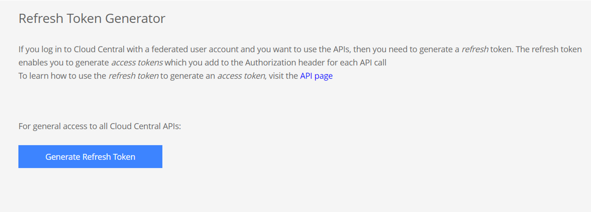

# Demo NetApp Cloud Manager API
Use NetApp Cloud API. This python scripts show how to work with NetApp Cloud API.

Thes scripts need to be used with **python 3**

The following python modules must be installed (Linux/Windows):
```
python3 -m pip install pyopenssl
python3 -m pip insatll urllib3
python3 -m pip install requests
```
# Install Cloud Manager Demo Scripts

## Copy the scripts from git
```
# cd <Installation Directory>
# git clone https://github.com/jbnetapp/demo-netapp-cloud-api
```
## For Unix create the following useful Aliases 
```
# echo "alias cloudaccount='python3 $PWD/demo-netapp-cloud-api/cloudaccount.py'" >> $HOME/.bashrc
# echo "alias cloudsync='python3 $PWD/demo-netapp-cloud-api/cloudsnyc.py'" >> $HOME/.bashrc
# echo "alias occm='python3 $PWD/demo-netapp-cloud-api/occm.py'" >> $HOME/.bashrc
# source $HOME/.bashrc
```

# Setup NetApp Cloud Manager Demo Scripts

## Use the script "cloudaccount.py --setup" to create the configuration files

**NetApp Cloud Central user can be Federated or Non-Federated:**

- **For Non-Federated users (Regular Access)** you need to enter username (email) and password:
    - Create the configuration file for Regular Access using **cloudaccount.py** script:
        ```
        # python3 cloudaccount.py --setup
        Is your NetApp Cloud Central use federated users ? [y/n] : n
        NetApp Cloud Central Email : <YOUR EMAIL NETAPP CLOUD CENTRAL>
        NetApp Cloud Central Password : <YOUR PASSWORD>       
        ```
- **For Federated user (ADFS, Microsfot AD, or SAML )** associate with your corporate email
    - If your user is federated user, you must use a **refresh token Access** to Acquire a JWT **access token** from the OAuth token endpoint.
    - To get your **refresh token Access** login to the https://services.cloud.netapp.com/refresh-token 
        - Click on **Generate Refresh Token** or click on **Revoke Token(s)** 
         Copy your token and save it in to the **api.conf** in section header **[API_LOGIN]** in variable **refresh_token**, as shown in the following example.
    - Create the Configuration File for federated users using **cloudaccount.py** script: 
        ```
        # python3 cloudaccount.py --setup
        Is your NetApp Cloud Central use federated users ? [y/n] : y
        To get your Refresh Token please go to : https://services.cloud.netapp.com/refresh-token
        NetApp Cloud Central Refresh Token : <YOUR_REFRESH_TOKEN>
        ```
**Configuration File:**
- For Linux configuration file is:  **$HOME/NetAppCloud/api.conf**
- For Windows configuration file is: **%homedrive%%homepath%\NetAppCloud\api.conf**

## Check your JWT access token  
When using **cloudaccount.py** script with option --setup to create the configuration file the **JWT access token** is automatically saved in the section header [API_TOKEN]. To Check if your **JWT access token** is valid you can use --token-check option.
```
# python3 cloudaccount.py --token-check
Access Token is valid
```

## Get a new JWT access token  
The **JWT access token** is limited in time and will expire after few days. If  **JWT access token** as expired a Code error **401** with message **TokenExpiredError: jwt expired** is return by the API:
```
# python3 cloudaccount.py --token-check
ERROR: {"code":401,"message":"TokenExpiredError: jwt expired"}
```
To Get a new **JWT access token** :
```
# python3 cloudaccount.py --token-get-new
```

Check if your new **JWT access token** is valid and saved in your private **api.conf** configuration file.
```
# python3 cloudsync.py --token-check
Access Token is valid
```
# How to Use the OCCM (Cloud Manager) Script:
The script **occm.py** show how to work with NetApp Cloud Manager API. The Cloud Manager  API documentation is available here : https://cloudmanager.netapp.com/api-docs/

## Display list of already deployed Cloud Volume ONTAP
```
# python3 occm.py --cvo-list
Name:[cvoaz01][Azure] id:[VsaWorkingEnvironment-tNz1RNLH] HA:[False] status[ON]
Name:[cvoaz02][Azure] id:[VsaWorkingEnvironment-7HRP4PQL] HA:[True] status[ON]
Name:[cvoaw03][Amazon] id:[VsaWorkingEnvironment-DPKWwhPC] HA:[False] status[ON]
```
## Get more details of an already deployed Cloud volume ONTAP
```
# occm --cvo-get VsaWorkingEnvironment-tNz1RNLH
Name:[cvoaz01][Azure] HA:[False] svm:[svm_cvoaz01] status[ON] mgmt[172.30.24.207]
```

## Get Full details in JSON format qof an already deployed Cloud Volume ONTAP
```
# occm --cvo-get VsaWorkingEnvironment-tNz1RNLH --json > /tmp/cvoaz01.json
```

## Get creation Parameters of an already deployed Coud Volume ONTAP
```
# python3 occm.py --cvo-get-creation-parameters VsaWorkingEnvironment-tNz1RNLH > /tmp/cvoaz01-config-parameters.json
```

## Recreate a new Azure Cloud Volume ONTAP Using JSON file create with otpion --cvo-get-creation-parameters
```
# python3 occm.py --cvo-az-create /tmp/cvoaz01-config-parameters.json
Creates a new Azure Cloud Volumes ONTAP working environment
Name:[cvoaz01b] id:[VsaWorkingEnvironment-4DEHFQMN] HA:[False] svm:[svm_cvoaz01b] provider[Azure]
```

## Create a new Cloud Volume ONTAP in Azure
```
# occm --cvo-az-create ./new-cvo-azure-single-cvoaz01-ws1.json
Creates a new Azure Cloud Volumes ONTAP working environment
Name:[cvoaz01] id:[VsaWorkingEnvironment-4DEHFQMN] HA:[False] svm:[svm_cvoaz01b] provider[Azure]
```

## Create a new Cloud Volume ONTAP HA in Azure
```
# python3 occm.py --cvo-az-create-ha ./new-cvo-azure-ha-cvoaz02-ws1.json
Creates a new Azure HA Cloud Volumes ONTAP working environment
Name:[cvoaz02] id:[VsaWorkingEnvironment-7HRP4PQL] HA:[True] svm:[svm_cvoaz02] provider[Azure]
```

## Create a new Cloud Volume ONTAP in AWS 
```
# occm --cvo-aw-create ./new-cvo-aws-single-cvoaw03-ws1.json
Creates a new AWS Cloud Volumes ONTAP working environment
Name:[cvoaw03] id:[VsaWorkingEnvironment-DPKWwhPC] HA:[False] svm:[svm_cvoaw03] provider[Amazon]
```
## Create a new Cloud Volume ONTAP HA in AWS
```
# occm --cvo-aw-create-ha ./new-cvo-aws-ha-cvoaw02-single-az-ws1.json
Creates a new AWS HA Cloud Volumes ONTAP working environment
Name:[cvoaw02] id:[VsaWorkingEnvironment-1uqJIydY] HA:[True] svm:[svm_cvoaw02] provider[Amazon]
```
## Stop an existing Cloud Volumoe ONTAP
```
# occm --cvo-stop VsaWorkingEnvironment-4DEHFQMN
Stop Cloud volumes ONTAP working environment ID: VsaWorkingEnvironment-4DEHFQMN
Name:[cvoaz01b] id:[VsaWorkingEnvironment-4DEHFQMN] HA:[False] status:[ON] provider[Azure]
WARNING: do you want to stop CVO [cvoaz01b] ? [y/n] : y
CVO Name:[cvoaz01b] stopped
```
## Start an existing Cloud Volumoe ONTAP
```
# occm --cvo-start VsaWorkingEnvironment-4DEHFQMN
Start Cloud volumes ONTAP working environment ID: VsaWorkingEnvironment-4DEHFQMN
Name:[cvoaz01b] id:[VsaWorkingEnvironment-4DEHFQMN] HA:[False] status:[ON] provider[Azure]
WARNING: do you want to stop CVO [cvoaz01b] ? [y/n] : y
CVO Name:[cvoaz01b] started
```
## Delete an existing Cloud Volumoe ONTAP
```
# occm --cvo-delete VsaWorkingEnvironment-4DEHFQMN
Delete cloud volumes ONTAP working environment ID: VsaWorkingEnvironment-4DEHFQMN
Name:[cvoaz01b] id:[VsaWorkingEnvironment-4DEHFQMN] HA:[False] svm:[svm_cvoaz01b] provider[Azure]
WARNING: do you want to delete the CVO [cvoaz01b] ? [y/n] :
WARNING: do you want to delete the CVO [cvoaz01b] ? [y/n] : y
CVO Name:[cvoaz01b] deleted
```

# How to Use the CloudSync Script:
The script **cloudsync.py** show how to work with NetApp Cloud API Sync API. The Cloud Sync API documentation is available here : https://api.cloudsync.netapp.com/docs/

## Example: Display NetApp Account list associate with your NetApp Central user
```
# python3 cloudsync.py --account-list
Print NetApp Account list:
Blanchet account_id: [account-yX7cS8vU]
Demo_SIM account_id: [account-j3aZttuL]
NetAppHCL account_id: [account-U0dbRcKS]
```

## Example: Display your CloudSync Databrokers
```
# python3 cloudsync.py --data-broker-list
Print NetApp data-borkers list:
Name:[vmazjb1] ID:[616d9c8d48301b1e6cdfe1df] PrivateIP:[172.30.31.5] TransferRate:[1753.016465568962] Status:[COMPLETE]
```

## Example: Create a new Cloud Sync Relation 
Example using the local [JSON file example file](https://github.com/jbnetapp/demo-netapp-cloud-api/blob/main/Example/new-cloudsync-relation-blob-to-blob-example.json) from this git repository to create a Cloud Sync relation between two Azure blobs.
```
# python3 cloudsync.py  --account-id account-U0dbRcKS --create-relation ./Example/new-cloudsync-relation-blob-to-blob-example.json
New cloud Sync relationship successfully created
```

- **Remarque**  to use the [JSON example file](https://github.com/jbnetapp/demo-netapp-cloud-api/blob/main/Example/new-cloudsync-relation-blob-to-blob-example.json) you must: 
    - Change the dataBrokerId with your one of your dataBorkerId. To get your dataBrokerID you can:
      - Use th script **cloudsny.py** with the option **--data-borker-list**  (see example above)  
      - Go to [cloudmanager](http://cloudmanager.netapp.com) -> sync -> Manager Data Broker -> Select your Data Broker and click on button **(>)** 
    - The source **jbblob** and the target **jblobcopy** Blobs must  exist in your **Azure** storage account 
    - The storage account name **jbblobazure** must also exist. 
- For more information about the JSON syntax used: https://api.cloudsync.netapp.com/docs/

## Example: Print Cloud Sync Relations list 
```
# python3 cloudsync.py --account-id account-U0dbRcKS --print
Print cloudsync relations:

id: 61c2e054b10e1f362ede48e1
account: 5e528f4504a9a4d63d6962de
dataBroker: 616d9c8d48301b1e6cdfe1df
source: {'protocol': 'azure', 'azure': {'storageAccountName': 'jbdemostorageaccount', 'container': 'jbblob', 'prefix': 'DIR', 'tags': [], 'provider': 'azure'}}
target: {'protocol': 'azure', 'azure': {'storageAccountName': 'jbdemostorageaccount', 'container': 'jbblobcopy', 'prefix': '', 'tags': [], 'blobTier': 'HOT', 'provider': 'azure'}}
type: Sync
status: DONE

```

## Example: Sync a Cloud Sync Relation 
```
# python3 cloudsync.py --account-id account-U0dbRcKS --sync 61c2e054b10e1f362ede48e1
Sync cloudsync relation ID: 61c2e054b10e1f362ede48e1

```

Verify if the relation is in RUNNING state Print CloudSync Relation again:
```
# python3 cloudsync.py --account-id account-U0dbRcKS --print
Print cloud sync relations:

id: 61c2e054b10e1f362ede48e1
account: 5e528f4504a9a4d63d6962de
dataBroker: 616d9c8d48301b1e6cdfe1df
source: {'protocol': 'azure', 'azure': {'storageAccountName': 'jbdemostorageaccount', 'container': 'jbblob', 'prefix': 'DIR1', 'tags': [], 'provider': 'azure'}}
target: {'protocol': 'azure', 'azure': {'storageAccountName': 'jbdemostorageaccount', 'container': 'jbblobcopy', 'prefix': '', 'tags': [], 'blobTier': 'HOT', 'provider': 'azure'}}
type: Sync
status: RUNNING
```

if you Sync agin the Cloud Sync relation during an existing sync action the script will display error message : 
```
# python3 cloudsync.py --account-id account-U0dbRcKS --sync 61c2e054b10e1f362ede48e1
Sync cloudsync relation ID: 61c2e054b10e1f362ede48e1
ERROR: {"code":400,"message":"A sync action is running right now, can not run another action"}
```

## Example: Delete a Cloud Sync relation
```
# python3 cloudsync.py --account-id account-U0dbRcKS --delete 61c2e054b10e1f362ede48e1 -d
Delete cloudsync relation ID: 61c2e054b10e1f362ede48e1
```

## Example: Display a Cloud Sync relation in JSON format
```
# python3 cloudsync.py --account-id account-U0dbRcKS --print --json
[
    {
        "account": 5e528f4504a9a4d63d6962de
        "dataBroker": "616d9c8d48301b1e6cdfe1df",
        "source": {
            "protocol": "azure",
            "azure": {
                "storageAccountName": "jbblobazure",
                "container": "jbblob",
                "prefix": "DIR1",
                "tags": [],
                "provider": "azure"
            }
        },
        "target": {
            "protocol": "azure",
            "azure": {
                "storageAccountName": "jbblobazure",
                "container": "jbblobcopy",
                "prefix": "DST1",
                "tags": [],
                "blobTier": "COOL",
                "provider": "azure"
            }
        },
        "settings": {
            "gracePeriod": 30,
            "deleteOnSource": false,
            "deleteOnTarget": false,
            "objectTagging": false,
            "retries": 3,
            "copyAcl": false,
            "files": {
                "excludeExtensions": [],
                "maxSize": 9007199254740991,
                "minSize": 0,
                "minDate": "1970-01-01",
                "maxDate": null,
                "minCreationDate": "1970-01-01",
                "maxCreationDate": null
            },
            "fileTypes": {
                "files": true,
                "directories": true,
                "symlinks": true
            },
            "compareBy": {
                "uid": false,
                "gid": false,
                "mode": false,
                "mtime": true
            },
            "schedule": {
                "syncInDays": 0,
                "syncInHours": 1,
                "syncInMinutes": 0,
                "nextTime": "2021-12-24T09:00:00.000Z",
                "isEnabled": true,
                "syncWhenCreated": true
            },
            "copyProperties": {
                "metadata": false,
                "tags": false
            }
        },
        "isQstack": false,
        "isCm": true,
        "phase": "Initial Copy",
        "group": "616d9c8dcec9f8eef6a411fa",
        "startTime": "2021-12-23T09:20:12.875Z",
        "createdAt": 1640251212876,
        "endTime": "2021-12-23T09:22:59.304Z",
        "id": "61c43f4c86f2ee48a82a0813",
        "relationshipId": "61c43f4c86f2ee48a82a0813",
        "activity": {
            "type": "Initial Copy",
            "status": "DONE",
            "errors": [],
            "failureMessage": "",
            "executionTime": 166429,
            "startTime": "2021-12-23T09:20:12.875Z",
            "endTime": "2021-12-23T09:22:59.304Z",
            "bytesMarkedForCopy": 1243560,
            "filesMarkedForCopy": 1,
            "dirsMarkedForCopy": 0,
            "filesCopied": 0,
            "bytesCopied": 0,
            "dirsCopied": 0,
            "filesFailed": 1,
            "bytesFailed": 1243560,
            "dirsFailed": 0,
            "filesMarkedForRemove": 0,
            "bytesMarkedForRemove": 0,
            "dirsMarkedForRemove": 0,
            "filesRemoved": 0,
            "bytesRemoved": 0,
            "dirsRemoved": 0,
            "bytesRemovedFailed": 0,
            "filesRemovedFailed": 0,
            "filesMarkedForIgnore": 0,
            "dirsScanned": 0,
            "filesScanned": 1,
            "dirsFailedToScan": 0,
            "bytesScanned": 1243560,
            "progress": 100,
            "lastMessageTime": "2021-12-23T09:22:59.307Z",
            "topFiveMostCommonRelationshipErrors": [
                {
                    "step": "TRANSFER",
                    "errorCode": "invalid_credentials",
                    "counter": 1,
                    "description": "source connection-string should be SAS Connection-string and not regular connection-string"
                }
            ]
        }
    }
]
```

## Debug mode:
```
# python3 cloudsync.py --account-id account-U0dbRcKS --account-list --debug
DEBUG: [DEFAULT: <Section: DEFAULT> ]
DEBUG: [API_LOGIN: <Section: API_LOGIN> ]
DEBUG: [API_TOKEN: <Section: API_TOKEN> ]
DEBUG: [API Configuration File: /home/blanchet/NetAppCloud/api.conf]
DEBUG: [access_token: ******************************************************************************************]
DEBUG: [url: https://api.cloudsync.netapp.com/api/accounts ]
DEBUG: [status_code: 200]
DEBUG: [text: [{"accountId":"account-yX7cS8vU","name":"Blanchet"},{"accountId":"account-j3aZttuL","name":"Demo_SIM"},{"accountId":"account-U0dbRcKS","name":"NetAppHCL"}]]
DEBUG: [content: b'[{"accountId":"account-yX7cS8vU","name":"Blanchet"},{"accountId":"account-j3aZttuL","name":"Demo_SIM"},{"accountId":"account-U0dbRcKS","name":"NetAppHCL"}]']
DEBUG: [reason: OK]
DEBUG: [access_token : *****************************************************************************************]
Print NetApp Account list:
DEBUG: [url: https://api.cloudsync.netapp.com/api/accounts ]
DEBUG: [status_code: 200]
DEBUG: [text: [{"accountId":"account-yX7cS8vU","name":"Blanchet"},{"accountId":"account-j3aZttuL","name":"Demo_SIM"},{"accountId":"account-U0dbRcKS","name":"NetAppHCL"}]]
DEBUG: [content: b'[{"accountId":"account-yX7cS8vU","name":"Blanchet"},{"accountId":"account-j3aZttuL","name":"Demo_SIM"},{"accountId":"account-U0dbRcKS","name":"NetAppHCL"}]']
DEBUG: [reason: OK]
DEBUG: [{'status': 'success', 'message': 'ok', 'accounts': '[{"accountId":"account-yX7cS8vU","name":"Blanchet"},{"accountId":"account-j3aZttuL","name":"Demo_SIM"},{"accountId":"account-U0dbRcKS","name":"NetAppHCL"}]', 'token': '****************']
Blanchet account_id: [account-yX7cS8vU]
Demo_SIM account_id: [account-j3aZttuL]
NetAppHCL account_id: [account-U0dbRcKS]
```

## Display CloudSnyc Script help option
```
# python3 cloudsync.py --help
usage: cloudsync.py [-h] [-d] [--account-id ACCOUNT_ID] [-j]
                    (--account-list | --data-broker-list | --create-relation CREATE_RELATION_FILE | --delete-relation DELETE_RELATION_ID | --sync-relation SYNC_RELATION_ID | --print-relations | --token-check | --token-get-new)

optional arguments:
  -h, --help            show this help message and exit
  -d, --debug           debug mode
  --account-id ACCOUNT_ID
                        select NetApp Cloud account ID
  -j, --json            print in json format
  --account-list        print cloudsnyc accounts
  --data-broker-list    print cloudsync data-brokers
  --create-relation CREATE_RELATION_FILE
                        create new cloudsync relation from json file
  --delete-relation DELETE_RELATION_ID
                        delete a cloudsync relation
  --sync-relation SYNC_RELATION_ID
                        sync a cloudsync relation
  --print-relations     print cloudsnyc relations list
  --token-check         check NetApp Cloud access token
  --token-get-new       get a new access token
```
